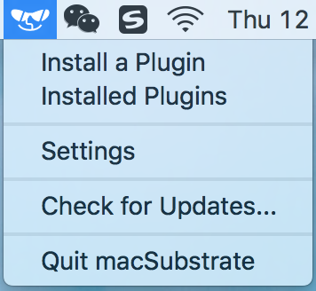
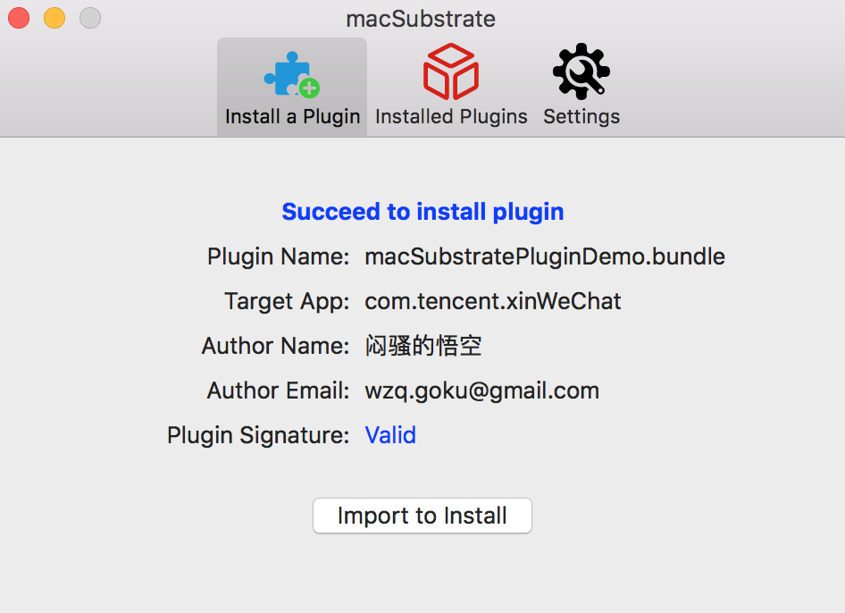
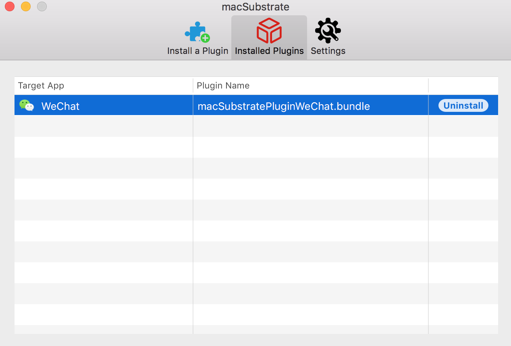

#  macSubstrate - Substrate for macOS #

**macSubstrate** is a platform tool for interprocess code injection on macOS, with the similar function to [Cydia Substrate](http://www.cydiasubstrate.com/) on iOS. Using macSubstrate, you can inject your plugins (`.bundle` or `.framework`) into a mac app (including sandboxed apps) to tweak it in the runtime.

* All you need is to get or create plugins for your target app.

* No trouble with modification and codesign for the original target app.

* No more work after the target app is updated.

* Super easy to install or uninstall a plugin.

* Loading plugins automatically whenever the target app is relaunched.

* Providing a GUI app to make injection much easier.

---

### Prepare

* [Disable SIP](https://developer.apple.com/library/content/documentation/Security/Conceptual/System_Integrity_Protection_Guide/ConfiguringSystemIntegrityProtection/ConfiguringSystemIntegrityProtection.html)

* [Why should disable SIP](https://developer.apple.com/library/content/releasenotes/MacOSX/WhatsNewInOSX/Articles/MacOSX10_11.html)

    > `System Integrity Protection is a new security policy that applies to every running process, including privileged code and code that runs out of the sandbox. The policy extends additional protections to components on disk and at run-time, only allowing system binaries to be modified by the system installer and software updates. Code injection and runtime attachments to system binaries are no longer permitted.`

---

### Usage

1. download [macSubstrate.app](https://github.com/wzqcongcong/macSubstrate/releases/latest), put into `/Applications` and launch it.

	

2. grant authorization if needed.

3. install a plugin by importing or dragging into macSubstrate.

	

4. launch the target app.

    *`step 3 and step 4 can be switched`*

    **Once a plugin is installed by macSubstrate, it will take effect immediately. But if you want it to work whenever the target app is relaunched or macOS is restarted, you need to keep macSubstrate running and allow it to automatically launch at login.**

5. uninstall a plugin when you do not need it anymore.

	

---

### Plugin

macSubstrate supports plugins of **`.bundle`** or **`.framework`**, so you just need to create a valid `.bundle` or `.framework` file. The most important thing is to add a key **`macSubstratePlugin`** into the `info.plist`, with the dictionary value:

| Key | Value |
| ------------- | ------------- |
| `TargetAppBundleID` | the target app's `CFBundleIdentifier`, this tells macSubstrate which app to inject. |
| `Description` | brief description of the plugin |
| `AuthorName` | author name of the plugin |
| `AuthorEmail` | author email of the plugin |

Please check the demo plugins [demo.bundle](macSubstratePluginDemo) and [demo.framework](macSubstratePluginDemo2) for details.

---

### Security

1. SIP is a new security policy on macOS, which will help to keep you away from potential security risk. Disable it means you will lose the protection from SIP.
2. If you install a plugin from a developer, you should be responsible for the security of the plugin. If you do not trust it, please do not install it. macSubstrate will help to verify the code signature of a plugin, and I suggest you to scan it using [VirusTotal](https://www.virustotal.com). Anyway, macSubstrate is just a tool, and it is your choice to decide what plugin to install.

---

### License

macSubstrate is released under the [MIT](https://en.wikipedia.org/wiki/MIT_License) license. See [LICENSE](LICENSE) for details.

---

### Thanks

macSubstrate is inspired and created with the help of following projects:

* [Cydia Substrate](http://www.cydiasubstrate.com/)
* [mach_inject](https://github.com/rentzsch/mach_inject)
